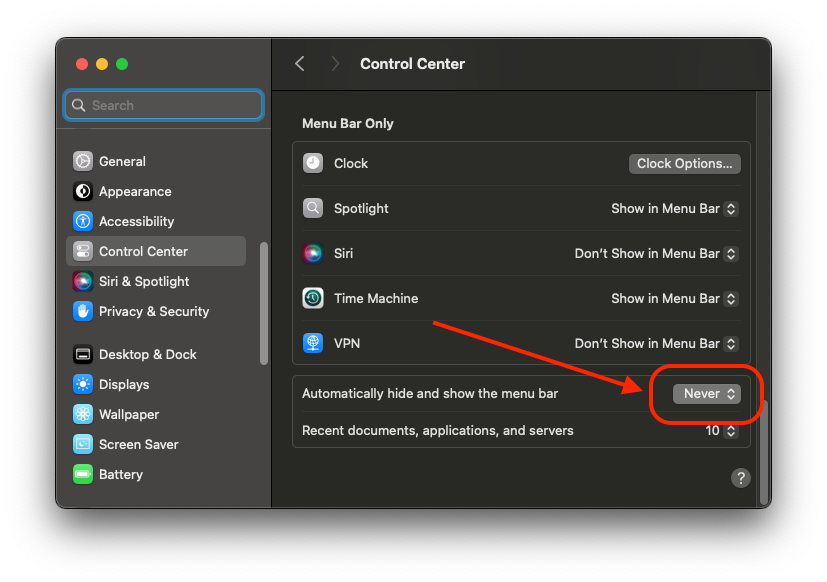

# Frequent Issues <!-- omit in toc -->

- [Items are moved to the always-hidden section](#items-are-moved-to-the-always-hidden-section)
- [IceMelt removed an item](#icemelt-removed-an-item)
- [IceMelt does not remember the order of items](#icemelt-does-not-remember-the-order-of-items)
- [How do I solve the `IceMelt cannot arrange menu bar items in automatically hidden menu bars` error?](#how-do-i-solve-the-icemelt-cannot-arrange-menu-bar-items-in-automatically-hidden-menu-bars-error)
- [The Menu Bar Layout pane shows app icons instead of the real items](#the-menu-bar-layout-pane-shows-app-icons-instead-of-the-real-items)
- [Some Control Center items refuse to move](#some-control-center-items-refuse-to-move)

## Items are moved to the always-hidden section

By default, macOS adds new items to the far left of the menu bar, which is also the location of IceMelt's always-hidden section. Most apps are
configured to remember the positions of their items, but some are not. macOS treats the items of these apps as new items each time they appear. This
results in these items appearing in the always-hidden section, even if they have previously been moved.

IceMelt does not yet reconcile individual items across relaunches. A canonical menu bar order with background reconciliation — which will file new
items into the section you chose for them — is planned for Phase 3 in [`PLAN.md`](PLAN.md).

## IceMelt removed an item

IceMelt does not have the ability to remove items. It likely got placed in the always-hidden section by macOS. Option + click the IceMelt icon to show
the always-hidden section, then Command + drag the item into a different section.

## IceMelt does not remember the order of items

This is not a bug, but a missing feature. It is tracked as the canonical-order work in Phase 3 of [`PLAN.md`](PLAN.md).

## How do I solve the `IceMelt cannot arrange menu bar items in automatically hidden menu bars` error?

1. Open `System Settings` on your Mac
2. Go to `Control Center`
3. Select `Never` as shown in the image below
4. Update your `Menu Bar Items` in `IceMelt`
5. Return `Automatically hide and show the menu bar` to your preferred settings

## The Menu Bar Layout pane shows app icons instead of the real items

This is IceMelt's fallback for when it cannot capture the menu bar. Grant Screen Recording permission in `System Settings → Privacy & Security →
Screen Recording` and relaunch IceMelt to get pixel-accurate item previews. Everything else keeps working without the permission — you just see each
item's app icon and name rather than its actual appearance.

## Some Control Center items refuse to move

Moving Control Center's own items (Sound, Focus, and similar) can fail with a "Move events failed" error. macOS 26 restricts synthetic drags on
Control Center's internal items; this is an OS limitation, not something IceMelt can work around today.
