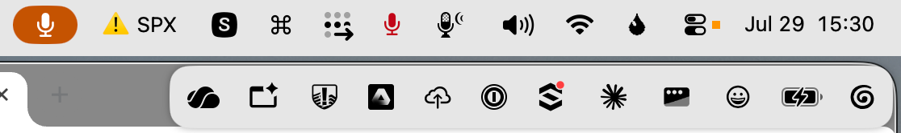
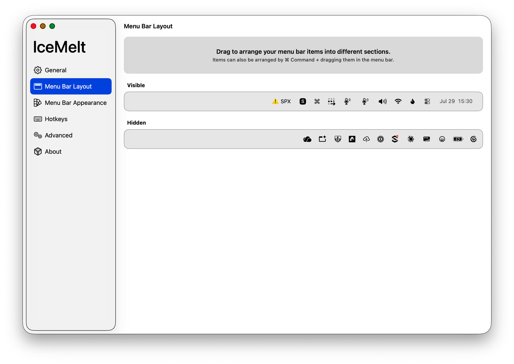
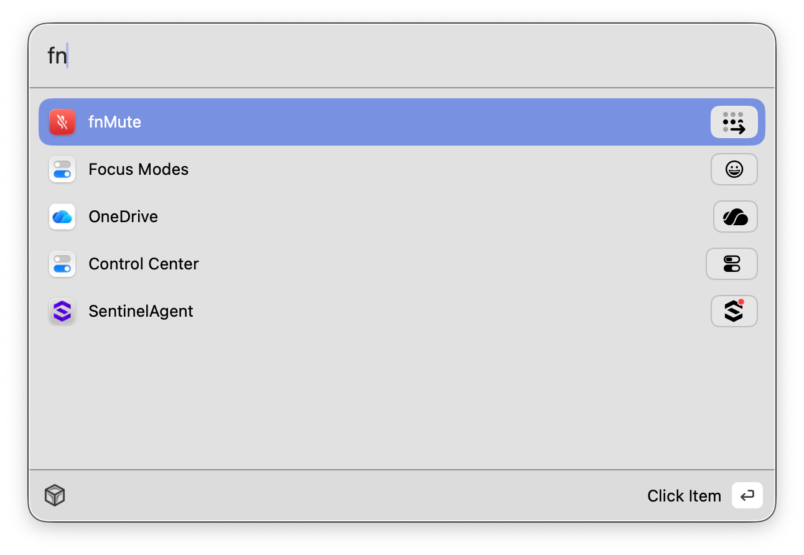
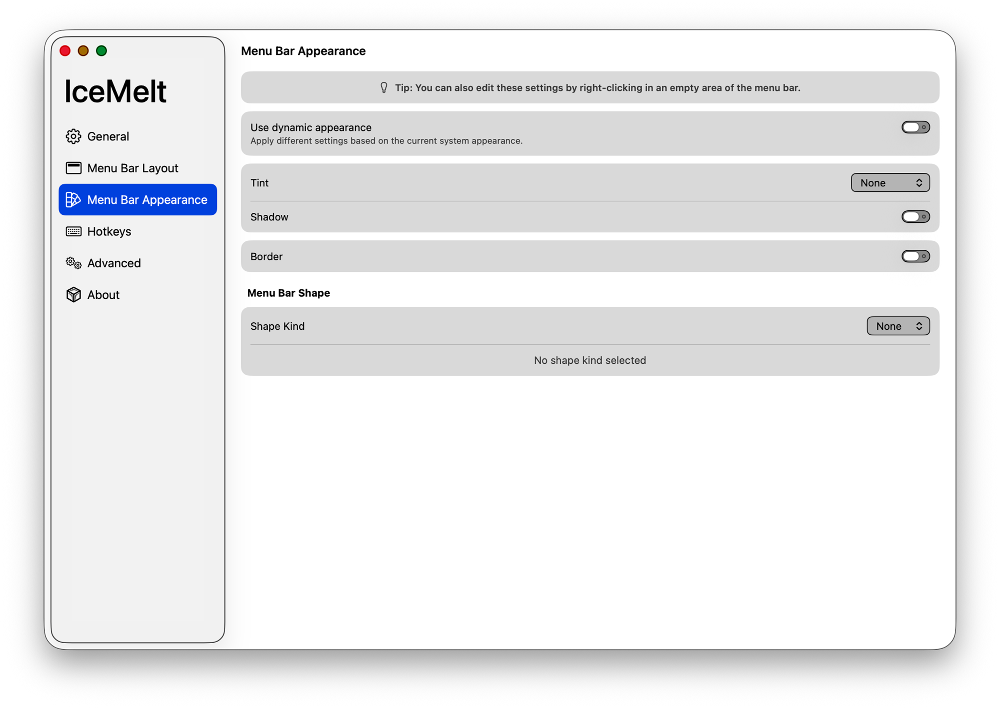
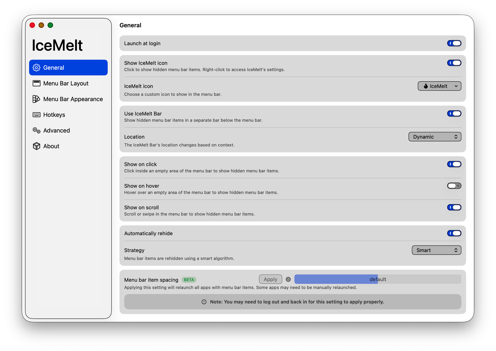

<div align="center">
    
    <h1>IceMelt</h1>
</div>

IceMelt is a menu bar management tool for macOS. Its primary function is hiding and showing menu bar items, alongside a range of additional features that make it one of the most versatile menu bar tools available.

IceMelt is a fork of [Ice](https://github.com/jordanbaird/Ice) by Jordan Baird, maintained by [Scratch Itch Software](https://scratchitchsoftware.com/icemelt). It exists to deliver a stable, actively maintained build for **macOS 26 (Tahoe) and later** — see [What IceMelt changes](#what-icemelt-changes) below.

[](https://github.com/pnikolaidis/icemelt/releases/latest)


[](https://scratchitchsoftware.com/icemelt)
[](LICENSE)

> [!NOTE]
> IceMelt is in active development. Download the latest release [here](https://github.com/pnikolaidis/icemelt/releases/latest), and see the roadmap below for upcoming work.

## Install

Download the `IceMelt-<version>.dmg` file from the [latest release](https://github.com/pnikolaidis/icemelt/releases/latest) and drag `IceMelt.app` into your `Applications` folder.

Releases are signed with a Developer ID certificate (Paradigm Consulting Company) and notarized by Apple, so they open without a Gatekeeper override.

There is no Homebrew cask for IceMelt yet. Note that `brew install --cask jordanbaird-ice` installs **upstream Ice**, not IceMelt.

### Requirements

macOS 26 (Tahoe) or later. See [Why does IceMelt only support macOS 26 and later?](#why-does-icemelt-only-support-macos-26-and-later)

### Updates

IceMelt checks its own signed update feed (`https://pnikolaidis.github.io/icemelt/appcast.xml`) via Sparkle. New versions are offered in-app; automatic checking and downloading are configurable in `Settings → About`.

## Build from source

Requires Xcode 26 or later.

```sh
git clone https://github.com/pnikolaidis/icemelt.git
cd icemelt
xcodebuild -project IceMelt.xcodeproj -scheme IceMelt -configuration Release build
```

Unsigned local builds are fine for development. Distributable builds are signed with a Developer ID certificate and notarized.

## What IceMelt changes

Relative to upstream Ice (0.11.x and the unreleased `macos-26` branch):

- **Tahoe-correct item identification.** Menu bar items are resolved through Accessibility (an `AXExtrasMenuBar` walk correlated with window IDs) instead of window ownership, which macOS 26 assigns wholesale to Control Center. Items show their real names and icons, and keep their sections across app relaunches.
- **No hard Screen Recording gate.** When capture is unavailable, the layout and search UIs fall back to app-derived icons and names instead of showing an empty pane.
- **IceMelt Bar fixes** for visibility and crashes on Tahoe, including correct backgrounds on external displays.
- **Its own identity and update channel** — bundle ID `com.pnikolaidis.icemelt`, an IceMelt droplet menu bar icon, and a self-hosted Sparkle appcast signed with our own key.

Phase-by-phase plans live in [`PLAN.md`](PLAN.md); the current snapshot is in [`docs/STATUS.md`](docs/STATUS.md).

## Features/Roadmap

### Menu bar item management

- [x] Hide menu bar items
- [x] "Always-hidden" menu bar section
- [x] Show hidden menu bar items when hovering over the menu bar
- [x] Show hidden menu bar items when an empty area in the menu bar is clicked
- [x] Show hidden menu bar items by scrolling or swiping in the menu bar
- [x] Automatically rehide menu bar items
- [x] Hide application menus when they overlap with shown menu bar items
- [x] Drag and drop interface to arrange individual menu bar items
- [x] Display hidden menu bar items in a separate bar (e.g. for MacBooks with the notch)
- [x] Search menu bar items
- [x] Menu bar item spacing (BETA)
- [ ] Canonical menu bar order with background reconciliation
- [ ] Profiles for menu bar layout
- [ ] Individual spacer items
- [ ] Menu bar item groups
- [ ] Show menu bar items when trigger conditions are met

### Menu bar appearance

- [x] Menu bar tint (solid and gradient)
- [x] Menu bar shadow
- [x] Menu bar border
- [x] Custom menu bar shapes (rounded and/or split)
- [x] Different settings for light/dark mode ("dynamic appearance")
- [ ] Remove background behind menu bar
- [ ] Rounded screen corners
- [ ] Full-black menu bar to hide the notch

### Hotkeys

- [x] Toggle individual menu bar sections
- [x] Show the search panel
- [x] Enable/disable the IceMelt Bar
- [x] Show/hide section divider icons
- [x] Toggle application menus
- [ ] Enable/disable auto rehide
- [ ] Temporarily show individual menu bar items

### Other

- [x] Launch at login
- [x] Automatic updates
- [x] Usable without Screen Recording permission (degraded item previews)
- [ ] Per-display behavior
- [ ] Settings export/import
- [ ] Automated test coverage
- [ ] Menu bar widgets

## Why does IceMelt only support macOS 26 and later?

IceMelt is built on the Tahoe adaptation of Ice, which reworks menu bar geometry, event handling, and item identification around behavior specific to macOS 26. Supporting macOS 14 and 15 would mean maintaining a large, untested compatibility matrix in exactly the code that is hardest to get right.

If you are on macOS 14 or 15, [upstream Ice 0.11.x](https://github.com/jordanbaird/Ice/releases) works well there.

## Gallery

#### Show hidden menu bar items below the menu bar

The IceMelt Bar holds everything from the hidden section, so the menu bar itself stays short.



#### Drag-and-drop interface to arrange menu bar items



#### Search menu bar items

Fuzzy search across every item, visible or hidden; Enter clicks the match.



#### Customize the menu bar's appearance

Tint, shadow, border, and custom menu bar shapes, with separate settings for light and dark mode.



#### Settings



## Contributing

Bug reports and feature requests belong in [IceMelt's issue tracker](https://github.com/pnikolaidis/icemelt/issues) — please don't file IceMelt problems on upstream Ice.

Before reporting a bug, check [FREQUENT_ISSUES.md](FREQUENT_ISSUES.md). Participation is governed by the [Code of Conduct](CODE_OF_CONDUCT.md).

Development happens on the `melt` branch (the default); `main` is kept in sync with it. Upstream Ice remains available as a git remote for cherry-picking. CI runs SwiftLint and a Release build on every push and pull request.

## License

IceMelt is available under the [GPL-3.0 license](LICENSE), the same license as upstream Ice.

Copyright © 2026 Scratch Itch Software. Based on [Ice](https://github.com/jordanbaird/Ice), © 2023–2025 Jordan Baird. If IceMelt is useful to you, consider [supporting Jordan Baird](https://github.com/sponsors/jordanbaird), whose work it is built on.
